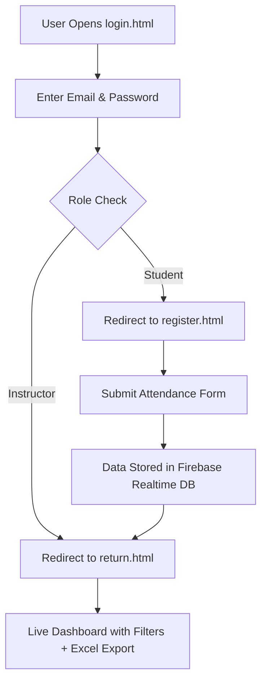

# firetrack
**FireTrack – A Cloud-Based Attendance Tracker for Smart Classrooms**

# 📅 Firebase Attendance System

A real-time attendance tracking web app using **Firebase Realtime Database**, allowing students to register attendance and instructors to monitor it dynamically — with built-in validation, late detection logic, and Excel export.


---

## 🚀 Features

- ✅ **Real-time attendance sync** with Firebase.
- 📥 **Student registration** with auto timestamp.
- 🔍 **Input validation** for name, ID, and email.
- ⏰ **Late arrival detection** based on configurable cutoff time.
- 📊 **Instructor dashboard** with live updates.
- 📤 **Downloadable Excel report** using SheetJS.
- 👨‍🏫 **Role-based login simulation** (Student / Instructor).

---

## 🧭 How It Works – Full Workflow

### 🔐 Login Page
- Users land on `login.html`.
- They must enter their **Email** and **Password**.
- The system verifies credentials from a predefined list (stored in JavaScript).

---

### 👥 Role-Based Routing
After login:
- 👨‍🎓 **Students** are redirected to `register.html` to mark their attendance.
- 👨‍🏫 **Instructors** are redirected to `return.html` to view the dashboard.

---

### 📝 Student Attendance Submission
On the `register.html` page:
- Students fill in:
  - Name
  - Student ID
  - Email
- Upon form submission:
  - ✅ Inputs are validated using **Regular Expressions (Regex)**.
  - 📤 Data is sent to **Firebase Realtime Database** with a timestamp.

---

### ☁️ Cloud Database Sync
- Attendance data is instantly stored in Firebase.
- Data becomes **immediately available** to instructors via their dashboard.

---

### 📊 Instructor Dashboard (`return.html`)
Instructors can:
- 🔍 View a live-updating table of student entries.
- 🟡 Filter **late arrivals** based on submission timestamp.
- 🔴 Identify **absent students** who didn’t register before the cutoff time.
- 📥 Export attendance reports to **Excel (using SheetJS)**.

---

## 🔁 Summary Diagram (Flowchart)


---


## 📂 Project Structure

```plaintext
📁 FirebaseAttendanceSystem
├── index.html         # Instructor dashboard (read-only view)
├── register.html      # Student attendance form
├── login.html         # Login page for students/instructors
├── return.html        # Instructor redirect after login
├── script.js          # Main dashboard logic (data rendering)
├── register.js        # Handles student form submission
├── login.js           # Simple role-based login logic
├── style.css          # All UI styling
├── README.md          # You’re here
````

---

## 🧠 Tech Stack

| Category     | Technology                                   |
| ------------ | -------------------------------------------- |
| Frontend     | HTML5, CSS3, Vanilla JavaScript              |
| Backend (DB) | Firebase Realtime Database                   |
| Auth         | Simulated with JavaScript (no Firebase Auth) |
| Export       | SheetJS (XLSX library)                       |

---

## ⚙️ Firebase Setup

To use this project with your own Firebase project:

1. Go to [Firebase Console](https://console.firebase.google.com/), create a new project.
2. Enable **Realtime Database** and set rules like:

```json
{
  "rules": {
    ".read": true,
    ".write": true
  }
}
```

> ⚠️ **Security Warning:** For production, replace these rules with proper authentication-based ones.

3. Copy your project’s Firebase config from Project Settings → Web App.
4. Replace the `firebaseConfig` objects in:

   * `script.js`
   * `register.js`

---

## 🖥️ How to Run Locally

### 🔹 Option 1: VS Code + Live Server

```bash
# Install Live Server extension
# Right-click register.html → "Open with Live Server"
```

### 🔹 Option 2: Manual Open

Simply double-click `register.html` or `index.html` in your browser.

---

## 📸 Screenshots

> *(Add screenshots of register form + dashboard + Excel export here once deployed)*

---

## 📤 Excel Export

In `index.html`, instructors can click a button to **download an Excel sheet** of current attendance using:

```js
XLSX.utils.table_to_book(table, { sheet: "Attendance" });
XLSX.writeFile(workbook, "AttendanceData.xlsx");
```

---

## 🔐 Login Simulation 

```js
const users = [
  { email: "student1@example.com", password: "1234", role: "student" },
  { email: "student2@example.com", password: "abcd", role: "student" },
  { email: "instructor1@example.com", password: "admin1", role: "instructor" },
  { email: "instructor2@example.com", password: "admin2", role: "instructor" }
];

if (role === "instructor") window.location.href = "return.html";
```

> You can easily extend this to Firebase Authentication.

---

## ✅ Validation Logic

Each field is validated before data submission:

| Field | Validation Regex               |
| ----- | ------------------------------ |
| ID    | `/^\d+$/`                      |
| Name  | `/^[a-zA-Z\u0600-\u06FF\s]+$/` |
| Email | `/^[^\s@]+@[^\s@]+\.[^\s@]+$/` |

---

## 📦 Example Firebase Entry

```json
"students": {
  "2025001": {
    "name": "Obaidah Essam",
    "email": "obaidah@example.com",
    "studentId": "2025001",
    "timestamp": "2025-07-18T09:15:32.123Z"
  }
}
```

---

## 📌 To-Do / Improvements

* [ ] Firebase Authentication integration
* [ ] Admin panel to edit/delete attendance records
* [ ] Store role-based user data in Firebase
* [ ] Improve security rules on database

---

## 📄 License

This project is licensed under the [MIT License](LICENSE).
Free to use, modify, and distribute with attribution.

---

## ✨ Developed by

**Obaidah Essam**
🔧 Automotive Embedded Systems | IoT for Smart Vehicles | Cloud-Connected Mobility
🚗 Passionate about tech-driven intelligent transportation solutions.

---

## ⭐ Support & Contributions

Feel free to fork, star, and contribute!
Pull requests and suggestions are welcome 🙌
